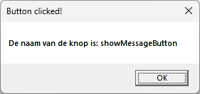
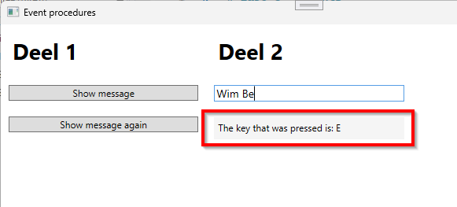
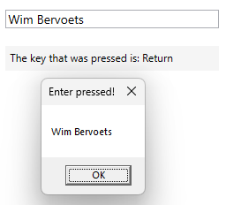
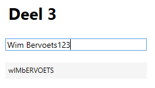
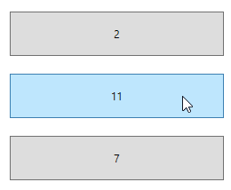

# Labo 6 - Event procedures

## Deel 1
- Maak een event procedure voor het click event van de *showMessageButton*
- Toon een *MessageBox* met de tekst "Er werd op de knop geklikt"
	``` 
	MessageBox.Show("Er werd op de knop geklikt"); 
	```

- Zorg ervoor dat dezelfde event procedure wordt uitgevoerd wanneer er op de *showAgainButton* geklikt wordt
- Wijzig nu de tekst van de MessageBox zodat de naam van de knop waar op geklikt werd wordt weergegeven als volgt:

	

	Gebruik slechts één event procedure voor beide knoppen!
	> Tip: Gebruik de *sender* parameter van de event procedure

## Deel 2
- Maak een event procedure voor het *KeyDown* event van de *nameTextBox*
- Toon het karakter dat werd ingegeven in de *nameTextBox* in het *nameOutputLabel*

	

- Wijzig de achtergrondkleur van de *nameTextBox* wanneer één van de functietoetsen wordt ingedrukt (F1 - F12), gebruik hiervoor de **reeds bestaande** functie *GetRandomColorBrush()*
	> Tip: Gebruik *Key* eigenschap van de *e* parameter van de event procedure
- Toon nu een MessageBox met de volledige naam wanneer de *Enter* toets wordt ingedrukt
	
	

## Deel 3
- Zorg ervoor dat alle alfanumerische (A-Z) karakters die worden ingegeven in de *originalTextBox* worden omgezet naar hoofdletters of omgekeerd. Toon de output in het *convertedLabel*
	
	

## Deel 4
- Maak **één** event procedure met de naam *counterButton_Click* en zorg dat deze wordt uitgevoerd bij het click-event van de 3 buttons: *firstButton*, *secondButton* en *thirdButton**
- Bepaal in de event procedure welke knop werd ingedrukt
- Verhoog het nummer wat wordt weergegeven als tekst van de knop met 1



## Extra
- Gebruik het SizeChanged event van het venster om de achtergrondkleur te wijzigen
	- Maak de achtergrondkleur groen indien de breedte van het venster groter is dan de hoogte
	- Maak de achtergrondkleur rood indien de hoogte van het venster groter is dan de breedte

- Gebruik het MouseEnter en het MouseLeave event van de titel-*Labels*
	- Onderlijn de tekst van het label wanneer de muis over het label beweegt
	- Verwijder de onderlijning wanneer de muis het label verlaat
